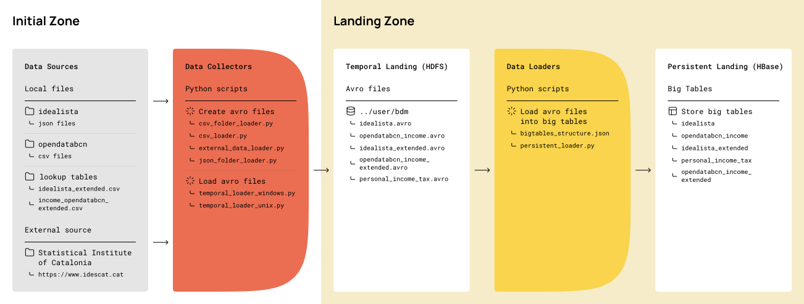

## Overview
This repository contains a comprehensive Big Data Management Backbone project, meticulously crafted by Danila Kokin and Dmitriy Chukhray. It is designed to seamlessly integrate and process large-scale data, providing an efficient and automated data pipeline from collection to storage.

## Data Sources
Our primary data source is the "Personal Income Tax" table from the Statistical Institute of Catalonia, encompassing data from 2000-2021. This data is critical for our project's second phase, where we delve into descriptive statistical analysis and predictive modeling. 

**Flexibility**: The data collection script (`external_data_loader.py`) is dynamically programmed, allowing for easy adaptation to different data sources from the institute’s website.

## Data Collectors
The data collection phase is powered by multiple Python scripts:

- `json_folder_loader.py`: Processes JSON files from Idealista, adding a `publication_date` column, and merges them into a single JSON object before converting to Avro format.

- `csv_folder_loader.py`: Similar to the JSON loader, this script works with CSV files, storing the combined data in a Pandas DataFrame, followed by Avro conversion.

- `csv_loader.py` & `temporal_loader.py`: These scripts facilitate the loading of lookup tables and the uploading of Avro files to the HDFS cluster.

## Data Persistent Loader
The project employs a single Python script alongside a JSON file (`bigtables_structure.json`) to design and create HBase big tables’ schemas.

`persistent_loader.py`: This script orchestrates the creation of big tables in HBase, leveraging the REST API, and populates these tables with data from Avro files.

## Running Instructions
To execute the data pipeline:

1. Run the `run.sh` shell script.
2. Ensure that the script points to the correct folder containing the necessary data files.

**Note**: The shell script is tailored for UNIX systems (macOS or Linux). Running it on Windows might require minor adjustments.

## Overall pipeline schema

## Contact

- Danila Kokin: danila.kokin@estudiantat.upc.edu
- Dmitriy Chukhray: dmitriy.chukhray@estudiantat.upc.edu
